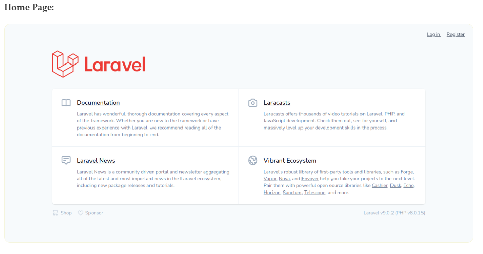
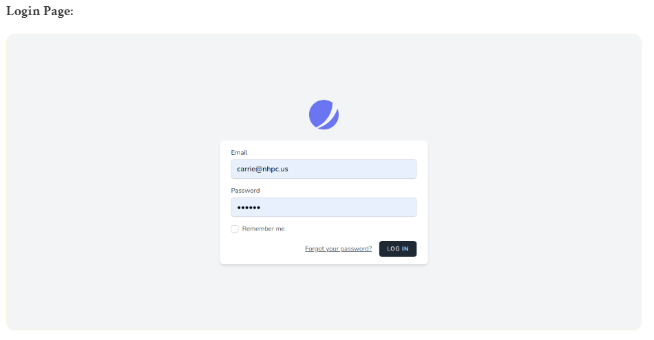
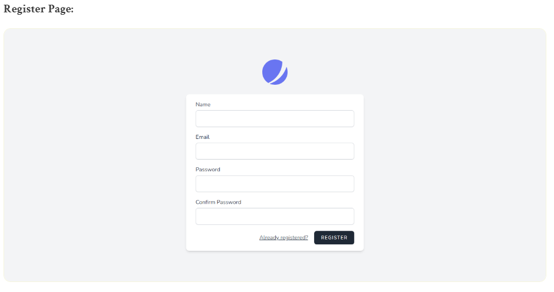
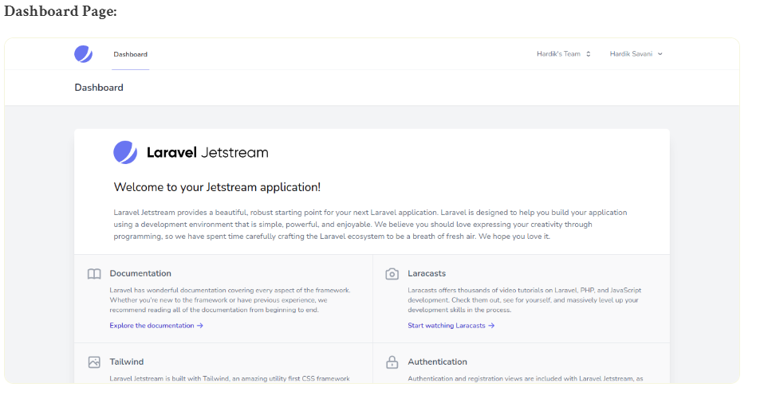
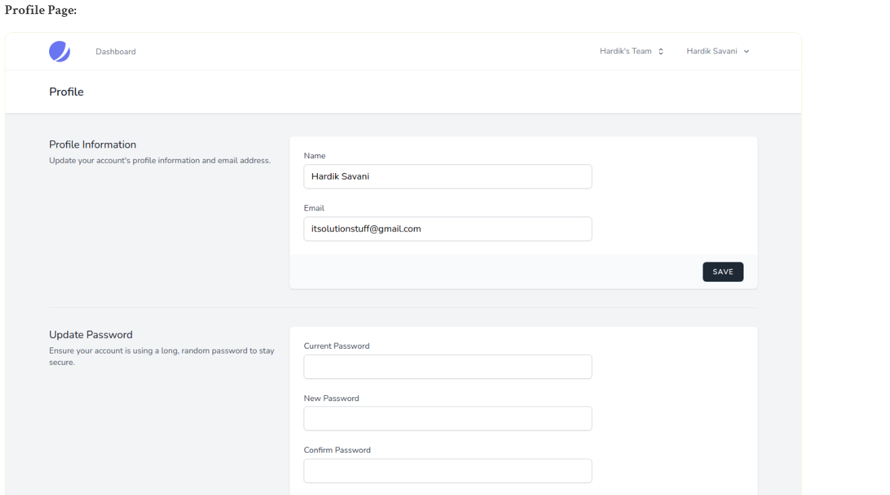
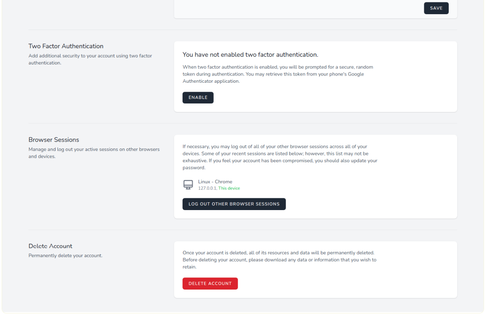
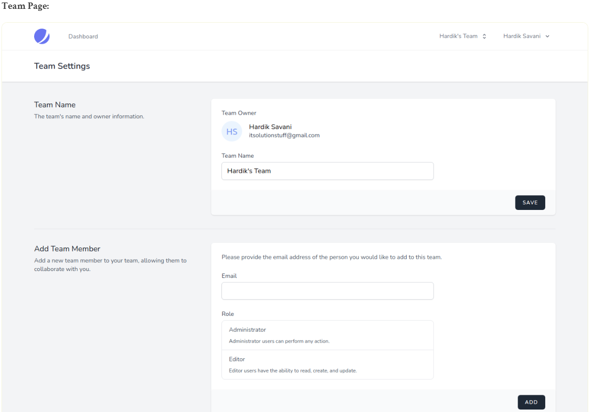

# laravel9_authentication_using_jetstream
- Laravel 9 jetstream được thiết kế bởi Tailwind CSS và họ cung cấp giàn giáo xác thực bằng cách sử dụng livewire và Inertia. Laravel jetstream cung cấp tính năng đăng nhập, đăng ký, xác minh email, xác thực hai yếu tố, quản lý phiên, API thông qua Laravel Sanctum và các tính năng quản lý nhóm có sẵn.
- Laravel Livewire là một thư viện giúp đơn giản hóa việc xây dựng các giao diện hiện đại, phản ứng, động bằng cách sử dụng Laravel Blade, bộ điều khiển Laravel và xác thực Laravel.
- Livewire cung cấp một cách để viết ajax của bạn bằng laravel blade, xác thực và tất cả, bạn có thể sử dụng như một khuôn khổ javascript. vì vậy chúng ta hãy xem bước dưới đây để tạo auth bằng laravel 9 livewire.
# Laravel 9 Auth Scaffolding using Livewire Jetstream
## 1. Install Laravel 9
```Dockerfile
composer create-project laravel/laravel laravel9_authentication_using_jetstream
```
- Install Jetstream:
```Dockerfile
composer require laravel/jetstream
```
- Create Auth with Livewire:
```Dockerfile
php artisan jetstream:install livewire
OR
php artisan jetstream:install livewire --teams
```
- Dùng node js package  
```Dockerfile
npm install
```
- run package
```Dockerfile
npm run dev
```
- run create database table
```Dockerfile
php artisan migrate
```
# Laravel 9 Auth Scaffolding using Inertia Jetstream
## 1. Install Laravel 9
```Dockerfile
composer create-project laravel/laravel laravel9_authentication_using_jetstream
```
## 2. Install Jetstream:
```Dockerfile
composer require laravel/jetstream  
```
-Create Auth with Inertia:
```Dockerfile
php artisan jetstream:install inertia
OR
php artisan jetstream:install inertia --teams 
```
- Dùng node js package  
```Dockerfile
npm install
```
- run package
```Dockerfile
npm run dev
```
- run create database table
```Dockerfile
php artisan migrate
```
# Laravel 9 Jetstream Features
Laravel 9 Jetstream cung cấp tất cả các tính năng mới đều có thể cấu hình được. bạn có thể thấy có tệp cấu hình fortify.php và tệp jetstream.php nơi bạn có thể bật và tắt tùy chọn cho tính năng đó:
-  Vào config / fortify.php
```Dockerfile
....
  
'features' => [
        Features::registration(),
        Features::resetPasswords(),
        Features::emailVerification(),
        Features::updateProfileInformation(),
        Features::updatePasswords(),
        Features::twoFactorAuthentication(),
    ],
...
```
-  Vào config/jetstream.php
```Dockerfile
....
  
'features' => [
        Features::profilePhotos(),
        Features::api(),
        Features::teams(),
    ],
...
```
# Run Laravel App:
```Dockerfile
php artisan serve
```
- Vào 
http://localhost:8000/








